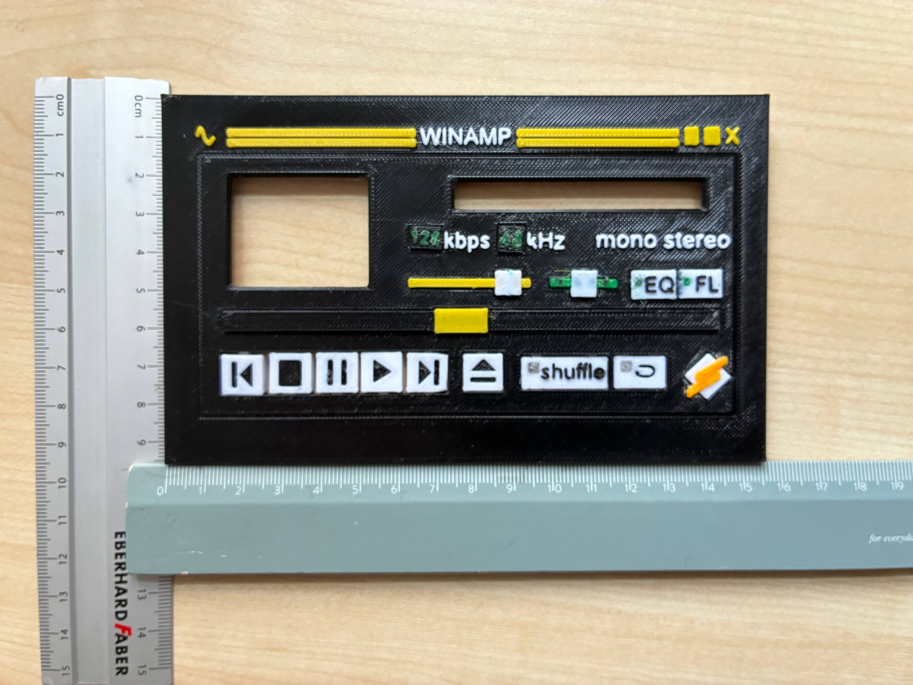
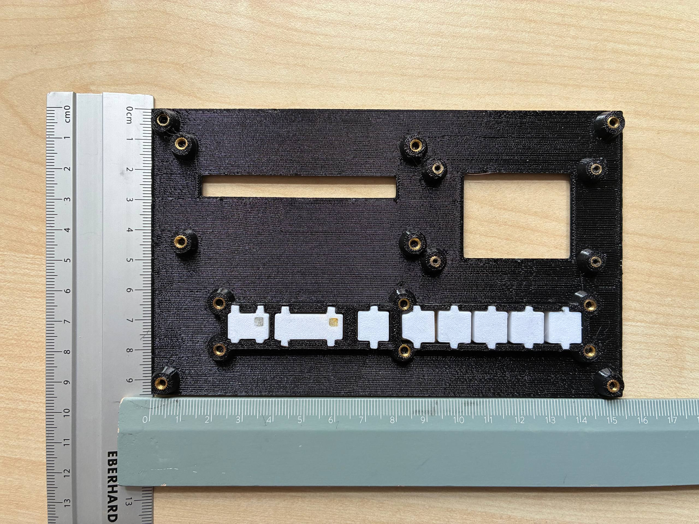

# WinampDeck

A hardware media player built into a 3D-printed Winamp-skin front panel. It plays Spotify Connect and internet radio through a Raspberry Pi 3 Model B, output entirely in digital form (optical S/PDIF) into an external amplifier, and is operated only from the panel's real, removable buttons — no phone app, no web UI.

The panel has two display cutouts (a 1.77" TFT and a single-row-visible LCD) and 8 functional buttons plus 2 LEDs behind the classic Winamp controls (Previous, Stop, Pause, Play, Next, Eject, Shuffle, Repeat). Everything else on the skin — the volume/balance sliders, EQ/FL labels, the visualizer swirl — is decorative.

## Hardware

- Raspberry Pi 3 Model B (1 GB RAM)
- HiFiBerry Digi+ Pro-compatible HAT (digital S/PDIF output)
- 1.77" SPI TFT, 128×160, ST7735(R)
- HD44780 1602 LCD (first row visible only) via an FC-113/PCF8574 I²C backpack
- MCP23017 I²C GPIO expander (buttons and LEDs)
- 5V/2.5A micro-USB power supply
- Enclosure: plywood, all electronics inside, front panel attached

## Software

A C++20 / CMake controller app orchestrates two long-lived engines — **go-librespot** for Spotify Connect and **mpv** for internet radio — with exactly one audible at a time, switched instantly via the panel's Eject button. There's no database, no web frontend, and no OAuth flow: Spotify auth happens via Zeroconf the moment a phone selects the Deck in its own Spotify app, and the radio station list is a hand-edited file.

See:
- [CONTEXT.md](CONTEXT.md) — the project's domain glossary (Deck, Source, Engine, Eject, Station, ...)
- [docs/architecture.md](docs/architecture.md) — how the software works, in plain language
- [docs/delivery-plan.md](docs/delivery-plan.md) — the phased build-out plan
- [docs/wiring.md](docs/wiring.md) — the 40-pin header allocation for the HAT, TFT, LCD, and button/LED expander

## Status

In design — no controller code yet. The hardware panel exists and is wired for buttons/LEDs; the software architecture is specified but not implemented.
