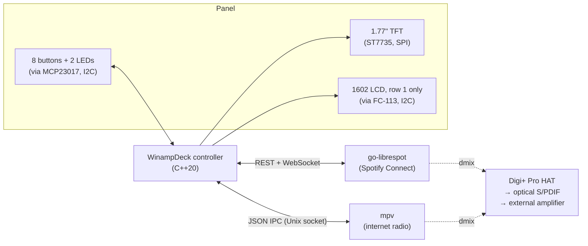
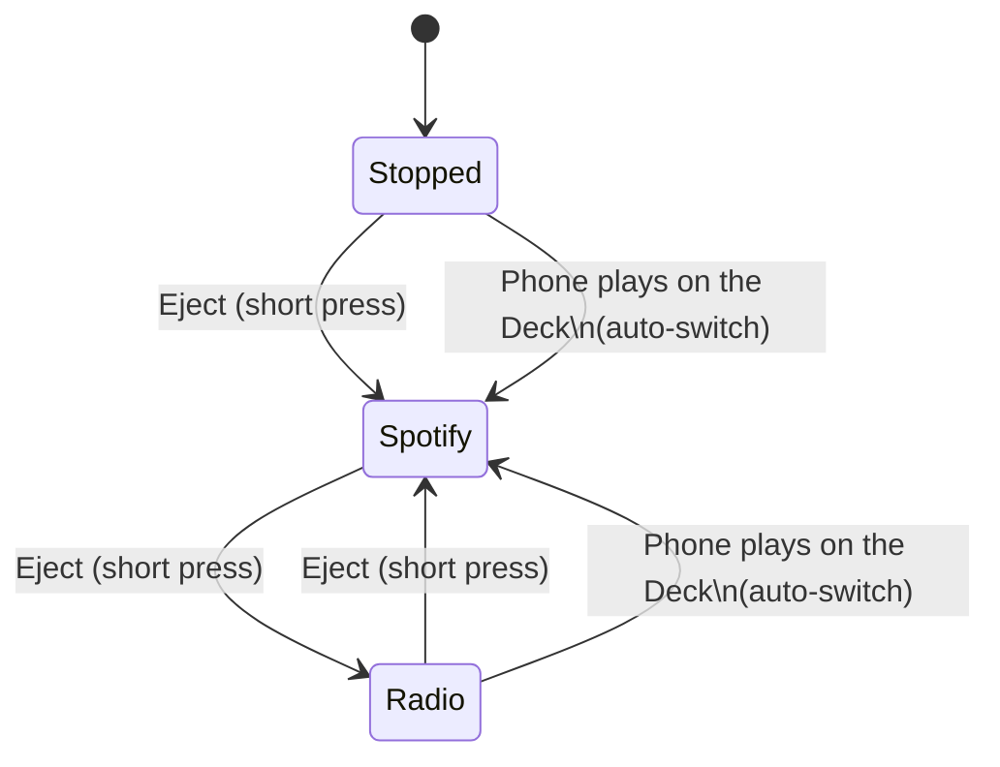

# Software Architecture

This is a plain-language walkthrough of how the WinampDeck controller works. For the terse, decision-by-decision record, see the [ADRs](adr/); for exact vocabulary, see [CONTEXT.md](../CONTEXT.md). This document is the story those pieces tell together.

## What the controller actually is

The Deck's brain is a single C++20 program running on the Raspberry Pi. It doesn't play any audio itself — it's an orchestrator, sitting between the physical panel and two other programs that do the real work:

- **go-librespot** plays Spotify, by pretending to be a Spotify Connect speaker.
- **mpv** plays internet radio, by streaming whatever URL it's told to.

Both of these run the whole time the Deck is powered on — they're never started or stopped as part of normal use. What changes, when you press a button, is which one of them is currently *audible*, and what the two displays show. That's really the whole job of the controller: watch the buttons, watch the two players, and keep the audio, the LEDs, and the two screens all telling a consistent story.

## Why two players run forever

Early on, the plan was closer to "switching sources stops one player and starts the other" — like changing the input on a receiver. That turned out to be the wrong model for two reasons. First, Spotify Connect only shows up as a speaker you can pick from your phone while its process is actually running and advertising itself on the network — if we killed it every time radio was playing, the Deck would keep vanishing from your Spotify app. Second, restarting a process on every switch means a delay, and this is meant to feel like pressing a button on real hardware, not waiting for something to boot.

So instead: both players are always running, and the controller just decides which one is allowed to make sound. This is called the **Source** — Spotify, Internet Radio, or Stopped, exactly one at a time. Switching Source means muting/pausing whichever player was audible and un-muting/resuming the other; neither process is ever restarted.

Stopped is only where the Deck starts: until Eject is pressed or a phone starts playing on it, every other button does nothing. From any state, holding Eject for about two seconds triggers a Safe Shutdown the moment the two seconds are up — while still held, so you know when to let go — after putting "Shutting down" on the LCD.

The auto-switch transitions — a phone pressing Play taking over automatically — only fire when the Spotify activity is actually happening *on this Deck*. A Spotify account can be playing on any of its devices, so "the account is playing" isn't enough. go-librespot already answers the right question: it emits `active` when this Deck becomes the account's Connect target and `inactive` when playback moves elsewhere, so the controller switches only when Spotify goes from not-playing-here to playing-here. No device-ID comparison is needed, and playing Spotify on your phone's own speaker never yanks the radio away. Because it reacts to that *change* rather than to every `playing` event, a late event that was already in flight when Eject paused Spotify can't bounce the Source straight back.

Switching back to a Source picks up where it left off: Spotify resumes only if it was playing when you switched away (and the session hasn't since moved to another device), and Radio comes back on the same Station, paused or not. The first switch to Radio tunes the first Station in the list.

## Talking to Spotify: go-librespot

The original, most widely-used Spotify Connect implementation (`librespot`, in Rust) turned out to be a dead end for one specific reason: it has no way for a local program to tell it "skip this track" or "pause." It only accepts commands over the Spotify Connect protocol itself, from whatever phone or desktop app most recently acted as controller. That's fine for playing music, but useless for wiring up physical Play/Pause/Next/Previous buttons.

`go-librespot` is a from-scratch reimplementation that solves exactly this: it exposes a small local web API on the Pi itself — plain REST calls for control (`play`, `pause`, `next`, `previous`), and a WebSocket stream of events for everything else (track changed, now playing, playback state). The controller uses the REST side when a button is pressed, and stays subscribed to the WebSocket side to keep the LCD/TFT and the auto-switch logic up to date. Authentication needs nothing from us at all: you just pick "WinampDeck" inside your own Spotify app, the same way you'd pick any other Connect speaker, and Spotify's app hands go-librespot a credential directly over the network. Anyone in the house can do this with their own account — the Deck isn't tied to one login.

## Talking to the radio: mpv

mpv is started once, as a background process, with its JSON control socket enabled. From then on the controller talks to it the same way any mpv remote-control frontend would: write a JSON command to the socket, read the JSON reply. mpv itself knows nothing about the station list — it only ever gets told "play this URL," "pause," "resume," "mute," or "unmute." Everything else is the controller's: Play/Pause act on the one loaded stream; Previous/Next step to the adjacent Station, wrapping around the ends; Shuffle jumps to a random Station other than the current one; and Repeat opens the Station List on the TFT, where Previous/Next move the highlight, Play tunes it, and Repeat backs out. The Shuffle and Repeat LEDs follow suit: for Spotify they mirror the shuffle/repeat state go-librespot reports (so a change made from a phone shows up too), while for Radio Shuffle's LED stays off and Repeat's means "Station List open."

## Sharing one audio output between two players

Both go-librespot and mpv ultimately want to write PCM audio to the same physical output — the HiFiBerry Digi+ Pro. Two processes can't normally open the same raw ALSA hardware device at once without one of them failing. The fix has two parts. First, both are configured to write to a `dmix`-wrapped version of the device rather than the raw hardware device — `dmix` is ALSA's own software mixer, built to let multiple programs share one output safely. They reach it through ALSA's `plug` layer (`plug:dmixer`), because the mixer runs at a fixed 48kHz and Spotify's 44.1kHz audio (and radio streams at all sorts of rates) would otherwise play back sped up; `plug` converts the rate on the way in. Second, the "muted" player needs to actually let go of the device rather than just going quiet: go-librespot already does this correctly on its own (it closes its audio handle whenever it's paused or idle), and mpv is told to deselect its audio track entirely (rather than just pausing) when it's the inactive Source, which makes it release the device the same way.

## The two displays

The TFT is a small color screen (ST7735 driver chip, 128×160 pixels) talked to directly over SPI — the controller sends raw pixel data, address-window commands, and manual reset/mode pin toggling, the same low-level way any embedded display like this is driven. It renders the Winamp-style skin, whatever's currently playing, and — when Internet Radio is the Source and you press Repeat — a scrollable list of your radio stations with their logos.

The LCD is the classic HD44780 character display, but the panel only exposes its first row through a narrow slot in the front — so functionally it's a single scrolling line of text, showing either "Artist — Track" or "Station — Stream Title" depending on the Source. It's wired over I²C through a small backpack chip rather than the usual handful of individual control wires.

Both displays, along with the button/LED expander chip, are driven through a single library (`pigpio`) rather than splitting hardware access across several different Linux subsystems — one library that knows how to do SPI, I²C, and GPIO, instead of three.

## What there isn't

There's no database, no web server, and no login flow anywhere in this design. That wasn't the original plan — the first sketch had a SQLite database and a web UI for Spotify login, station management, and settings — but each piece of that turned out to be solving a problem that had already gone away. Spotify auth doesn't need a login page because Zeroconf handles it. Settings (brightness, LCD scroll speed) turned out to be "set once during debug, never touched again," which is a config file's job, not a database's. Nobody was going to read back a play-history log. And diagnostics, for a developer comfortable on the command line, is just SSH and `journalctl`. So all persistent state on the Deck is two plain files: a config file for settings, and a hand-edited `stations.csv` for the radio station list — both read once at startup, both edited directly on the filesystem, never through the Deck itself.

## One event loop, not many threads

Everything the controller waits on — a timer tick for LCD scrolling, the Eject button's long-press timer, the socket to mpv, the WebSocket to go-librespot — is registered with a single library (standalone Asio) that runs one loop, reacting to whichever thing happens next. The alternative would be a separate thread per input source, each blocked waiting on its own thing, with locks to keep them from stepping on each other's toes when they all need to update "what's on the LCD right now." One loop, one thread, no locks.

## Built to be tested without hardware

The button/Source/display logic — the actual decision-making part of the app, a single `PlayerController` — is written against three narrow interfaces rather than talking to go-librespot, mpv, or pigpio directly: `EngineClient` for Spotify control and events, `RadioClient` for radio control, and `HardwareIO` for buttons/LEDs/displays. Two even smaller ones cover the rest of the outside world: a `Scheduler` for timers (the Eject long press), and `SystemControl` for the Safe Shutdown poweroff. In production those are backed by the real REST/WebSocket client, the real mpv IPC socket, real pigpio calls, Asio timers, and a real poweroff. In tests, they're backed by simple fakes — including a clock the test moves forward by hand — so the whole state machine — what happens on a short vs. long Eject press, how Shuffle differs between Spotify and Radio, Station List navigation, when auto-switch fires — can be exercised and verified without a Raspberry Pi, a Spotify account, or a soldering iron anywhere nearby.

`PlayerController` doesn't draw anything itself. It works out *what* the panel should show — the LED states, the LCD's one line of text ("Artist — Track" or "Station — Stream Title"), and either a Now Playing or a Station List screen for the TFT — and hands that to `HardwareIO` whenever it changes. How it looks (the Winamp skin, the font, the scrolling) belongs to the display code underneath.

## Where to look next

- [CONTEXT.md](../CONTEXT.md) — the exact vocabulary this document and the code should use
- [docs/adr/](adr/) — why each of these decisions was made, and what was considered instead
- [.tracker/controller-v1/spec.md](../.tracker/controller-v1/spec.md) — user stories, the full button map, and what's explicitly out of scope
